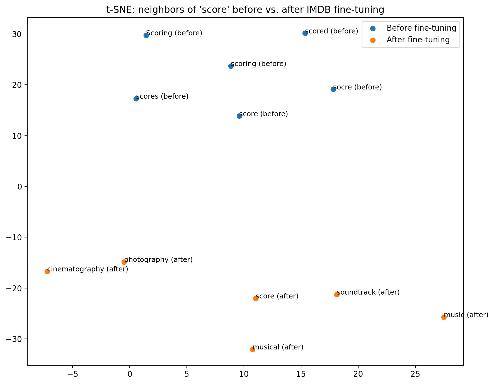
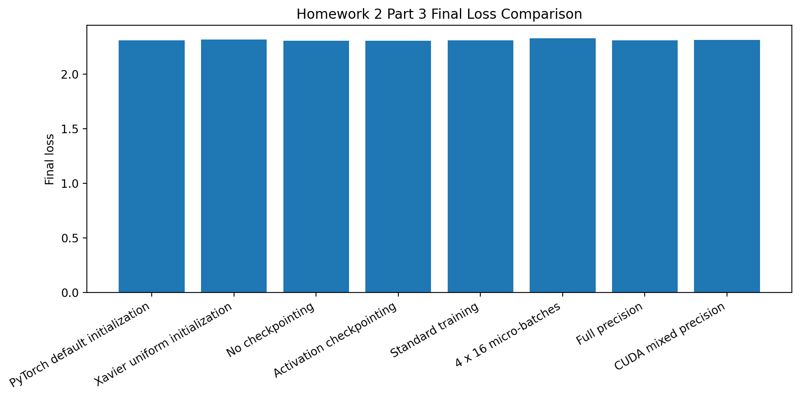

# DATA 266 — HW2

| Parameter | Value |
| --------- | ----: |
| SID4      |  9486 |
| SEED      |  9486 |
| SLICE     |   486 |
| HP\_ID    |     0 |
| CLS\_A    |     6 |
| CLS\_B    |     0 |

`SEED=9486` was used for stochastic operations (NumPy/PyTorch seeds, Word2Vec `seed`, Transformers `set_seed`, and t-SNE `random_state`). `SLICE=486` and `HP_ID=0` are reported for standing personal-parameter requirements but were not used to alter HW2 experiments because HW2 does not define an HP_ID mapping. `CLS_A=6` and `CLS_B=0` are likewise reported only.

## 1. Embedding-Based Transfer Learning

### 1.1 Objective

Start from Google News `word2vec-google-news-300` embeddings, inspect nearest neighbors for five movie-review words, fine-tune a new Word2Vec model on IMDB review text, then measure neighbor change and each target word’s own vector movement.

### 1.2 Dataset, Tokenization, and Fine-Tuning

The local IMDB CSV contains 50,000 reviews with `review` and `sentiment` columns. In Colab the file was read from `/content/IMDB Dataset.csv` with `engine="python"` after a default CSV parser failure; artifact configuration still records the repository path `data/IMDB Dataset.csv`. The first **10,000** reviews were used.

Tokenization lowercased text, replaced HTML ` ` tags with spaces, removed non-alphanumeric characters except apostrophes, and split on whitespace.

| Setting | Observed value |
| --- | --- |
| Pretrained model | `word2vec-google-news-300` (vocab 3,000,000; dim 300) |
| Reviews used | 10,000 |
| Window | 5 |
| Min count | 2 |
| Epochs | 5 |
| Workers | 4 |
| Seed | 9486 |
| Shared words initialized from pretrained vectors | 26,556 |

### 1.3 Baseline and Post-Fine-Tuning Neighbors

Baseline top-3 neighbors (cosine similarity):

| Word | Neighbor 1 | Sim | Neighbor 2 | Sim | Neighbor 3 | Sim |
| --- | --- | ---: | --- | ---: | --- | ---: |
| cast | casts | 0.7219 | casting | 0.7188 | Cast | 0.6638 |
| score | scoring | 0.7197 | scores | 0.6596 | scored | 0.6384 |
| plot | plots | 0.7625 | Plot | 0.6524 | plotting | 0.6328 |
| screen | screens | 0.7729 | onscreen | 0.6115 | LCD_screen | 0.5599 |
| review | reviewed | 0.6630 | reviewing | 0.6610 | reviews | 0.6380 |

After IMDB fine-tuning:

| Word | Neighbor 1 | Sim | Neighbor 2 | Sim | Neighbor 3 | Sim |
| --- | --- | ---: | --- | ---: | --- | ---: |
| cast | casting | 0.6610 | actors | 0.6380 | performances | 0.6271 |
| score | soundtrack | 0.6945 | cinematography | 0.6470 | music | 0.6255 |
| plot | storyline | 0.7121 | story | 0.6920 | script | 0.6227 |
| screen | screens | 0.5805 | stage | 0.4860 | lebowski | 0.4396 |
| review | comment | 0.6588 | reviews | 0.6376 | recommendation | 0.5854 |

### 1.4 Vector Shift

Shift is defined as `1 − cosine_similarity(original_vector, fine_tuned_vector)` for the same word. Lower cosine similarity means larger movement.

| Word | Cosine similarity (original vs fine-tuned) | Shift |
| --- | ---: | ---: |
| review | 0.609045 | 0.390955 |
| score | 0.622409 | 0.377591 |
| screen | 0.676173 | 0.323827 |
| plot | 0.701515 | 0.298485 |
| cast | 0.781051 | 0.218949 |

Most shifted: **review** (similarity 0.609045, shift 0.390955). Least shifted: **cast** (similarity 0.781051, shift 0.218949).

### 1.5 Interpretation and Limitations

Neighbors moved from morphological/general associates (e.g., score→scoring/scores) toward movie-review language (score→soundtrack/cinematography/music; plot→storyline/story/script; cast→actors/performances). The t-SNE figure for `score` shows separated before/after neighbor clouds consistent with that domain shift.

Limitations: Word2Vec with multiple workers can still vary across environments; only 10,000 reviews were used; cosine shift measures movement of a word’s own vector, not neighbor-list quality; t-SNE is a 2-D projection and can distort distances.

## 2. Retrieval-Augmented Generation

### 2.1 Sources and Loading

Ten movie pages were required: Inception, The Godfather, Titanic (1997 film), The Dark Knight, Pulp Fiction, Forrest Gump, The Matrix, Interstellar, Parasite (2019 film), and Gladiator (2000 film).

`WikipediaLoader` was attempted first but failed with a `JSONDecodeError` against the Wikipedia API in the Colab environment. Documents were therefore loaded with LangChain `WebBaseLoader` using the official English Wikipedia URLs for those titles. Ten documents loaded successfully.

### 2.2 Chunking, Embeddings, Prompt, and LLM

| Component | Observed setting |
| --- | --- |
| Primary chunk size / overlap | 500 / 50 |
| Alternate chunk size / overlap | 800 / 100 |
| Chunks after primary split | 3,411 |
| Embedding model | `sentence-transformers/all-MiniLM-L6-v2` |
| Vector store | FAISS |
| Retriever | FAISS `as_retriever(k=3)` |
| Prompt | Explicit `PromptTemplate` with `context` and `question` |
| Context formatting | Concatenated retrieved `page_content` strings |
| LLM | `google/flan-t5-base` via Transformers `text2text-generation` |

The pipeline kept PromptTemplate, retriever, context formatting, and LLM call separate (no `RetrievalQA` chain).

### 2.3 Questions, Retrieval, and Answers

**Q1.** Who directed Inception, and what is its central plot concept?  
**Answer:** Christopher Nolan  

Rank 1 (Inception): opening synopsis naming Christopher Nolan and describing subconscious heist / idea implantation. Ranks 2–3 were review commentary and reference lines. Retrieval succeeded (first relevant rank **1**). The generated answer named the director but omitted the plot concept present in rank 1.

**Q2.** Who played Don Vito Corleone in The Godfather?  
**Answer:** Marlon Brando  

Rank 1 casting passage states Marlon Brando was chosen to portray Vito Corleone. First relevant rank **1**. Success.

**Q3.** What ship is central to the story of Titanic?  
**Answer:** Titanic  

All three retrieved passages were footnote/reference lines about the film, not a clear encyclopedic statement identifying RMS Titanic as the ship. Automatic keyword `"rms titanic"` was absent. Manual inspection still finds the top-3 uninformative for the ship question, so this is treated as a retrieval failure rather than a keyword-only failure. The short answer “Titanic” is plausible from the page title but was not grounded in a strong retrieved passage.

**Q4.** Who is the main antagonist in The Dark Knight?  
**Answer:** Gambol  

Top-3 passages were sequel/reference snippets mentioning Gambol, not the Joker. The model answered **Gambol**, which is incorrect; the main antagonist is the Joker. Genuine RAG failure.

**Q5.** What major Oscar award did Parasite win?  
**Answer:** Best Picture  

Rank 2 states Parasite won Best Picture (among four Oscars). First relevant rank **2**. Success.

### 2.4 Alternate Chunking (800 / 100)

Exactly the Inception and Godfather questions were re-run.

| Question | 500/50 answer | 800/100 answer | Top chunk change |
| --- | --- | --- | --- |
| Inception director/plot | Christopher Nolan | Christopher Nolan | Opening synopsis → production quote about DiCaprio’s emotional journey |
| Godfather / Vito Corleone | Marlon Brando | Marlon Brando | Casting passages remained similar |

Answers did not change for either question.

### 2.5 Retrieval Success Rate

Manual evaluation after reading complete retrieved passages:

| Question | First relevant rank | Success |
| --- | ---: | --- |
| Inception | 1 | Yes |
| The Godfather | 1 | Yes |
| Titanic | — | No |
| The Dark Knight | — | No |
| Parasite | 2 | Yes |

**Retrieval Success Rate: 3/5 = 60.00%** (matches `artifacts/part2/rag_configuration.json`).

### 2.6 Genuine RAG Failures

1. **The Dark Knight / Gambol.** Retrieved chunks were citation fragments about Gambol rather than Joker-centered plot or cast text. With that context, `flan-t5-base` answered “Gambol,” which is wrong for the main antagonist. Failure mode: noisy HTML/reference retrieval + generation from misleading context.

2. **Titanic ship question.** Top-3 chunks were reference footnotes (`↑ Nygaard…`, `Gilchrist…`, etc.) without a clear ship-identity passage. WebBaseLoader also ingested substantial Wikipedia chrome, producing 3,411 chunks and diluting useful content. Failure mode: retrieval returned low-value reference text even though a correct short answer (“Titanic”) can be guessed from the page title.

An additional generation limitation: Inception rank-1 context contained both director and plot idea, but the LLM returned only “Christopher Nolan.”

## 3. Training Optimization Techniques

### 3.1 Shared Setup

Executed on Google Colab with **CUDA available**, GPU **Tesla T4**, PyTorch **2.11.0+cu128**, device `cuda`, seed **9486**.

| Setting | Value |
| --- | ---: |
| Input dim | 128 |
| Hidden dim | 256 |
| Output dim | 10 |
| Batch size / effective batch | 64 |
| Training steps | 40 |
| Optimizer | Adam |
| Learning rate | 0.001 |
| Accumulation micro-batch | 4 × 16 |
| Tensor creation shape / iterations | (4096, 512) / 25 |

### 3.2 Results

| Technique | Configuration | Device | Time (s) | Peak memory (MB) | Final loss |
| --- | --- | --- | ---: | ---: | ---: |
| Tensor creation | CPU tensor creation | cpu | 0.323885 | — | — |
| Tensor creation | GPU tensor creation | cuda | 0.012795 | 1059.211 | — |
| Weight initialization | PyTorch default | cuda | 0.286958 | 1061.305 | 2.309902 |
| Weight initialization | Xavier uniform | cuda | 0.062525 | 1061.305 | 2.318031 |
| Activation checkpointing | No checkpointing | cuda | 0.134194 | 1070.089 | 2.303427 |
| Activation checkpointing | Activation checkpointing | cuda | 0.260050 | 1071.089 | 2.303427 |
| Gradient accumulation | Standard training | cuda | 0.069160 | 1062.305 | 2.309902 |
| Gradient accumulation | 4 × 16 micro-batches | cuda | 0.212517 | 1062.305 | 2.328997 |
| Mixed precision | Full precision | cuda | 0.066441 | 1062.305 | 2.309902 |
| Mixed precision | CUDA mixed precision | cuda | 0.319262 | 1062.306 | 2.310822 |

### 3.3 Findings and Limitations

GPU tensor creation was much faster than CPU (0.0128 s vs 0.3239 s). Final losses across training comparisons stayed near ~2.30–2.33 on the short synthetic task, so loss differences were small. Xavier finished faster than default initialization in this run. Activation checkpointing increased wall time (0.260 s vs 0.134 s) without reducing measured peak allocated memory on this small DeepMLP. Gradient accumulation and mixed precision also increased time relative to their matched baselines here; mixed-precision peak memory was essentially unchanged at this model scale.

CUDA and mixed-precision measurements were available on the Tesla T4 runtime; CPU peak memory for tensor creation was recorded as unavailable (`NaN`). These micro-benchmarks are sensitive to warm-up, allocator state, and model size, so absolute memory rankings should be interpreted cautiously.

## 4. Artifacts

Primary evidence lives under `artifacts/part1/`, `artifacts/part2/`, `artifacts/part3/`, and `figures/hw2/`. No checkpoints were written for HW2.
