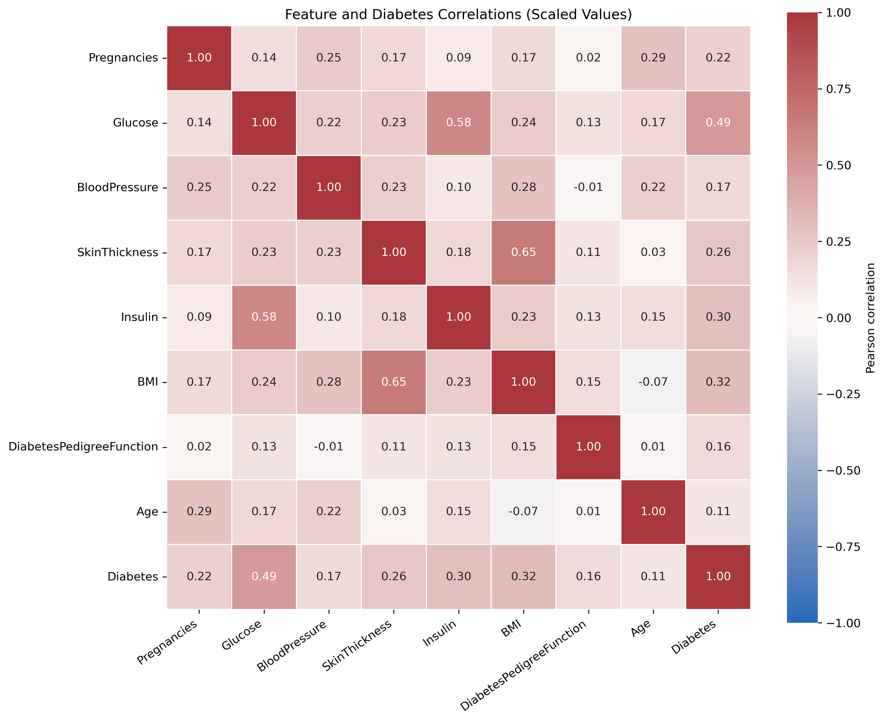
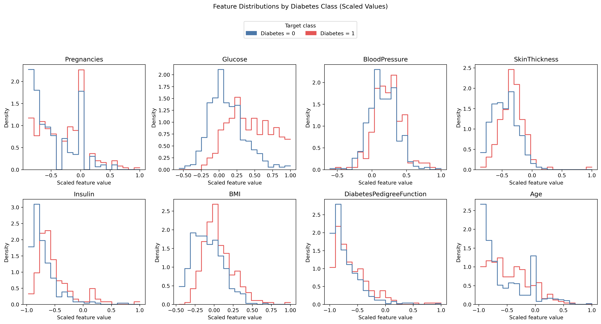

# DATA 266 — HW1

| Parameter | Value |
| --------- | ----: |
| SID4      |  9486 |
| SEED      |  9486 |
| SLICE     |   486 |
| HP\_ID    |     0 |
| CLS\_A    |     6 |
| CLS\_B    |     0 |

## 1. Autoregressive Models

An autoregressive (AR) model is a statistical model that uses the previous values of a time series to predict its current or future value. A time series is a collection of observations recorded sequentially over time, such as daily temperatures, monthly sales, electricity demand, or stock prices.

The previous observations used by the model are called lagged values. For example, a lag of 1 refers to the immediately preceding observation, while a lag of 2 refers to the observation two time steps earlier. An autoregressive model of order \(p\), written as AR(\(p\)), uses the previous \(p\) values:

$$
y_t = c + \phi_1 y_{t-1} + \phi_2 y_{t-2} + \cdots + \phi_p y_{t-p} + \epsilon_t
$$

Here, \(y_t\) is the value being predicted, \(c\) is a constant, and the \(\phi\) terms are learned coefficients that determine how strongly each lagged value influences the prediction. The term \(\epsilon_t\) represents unpredictable error, and \(p\) is the number of lagged values used.

For example, an AR(2) temperature model predicts today's temperature using the temperatures from yesterday and two days ago. AR models can also forecast electricity demand from previous demand, forecast future sales from earlier sales, analyze financial values using their recent history, and predict weather measurements from previous measurements.

AR models are relatively simple and computationally efficient, and their coefficients are interpretable. They often capture useful short-term dependencies in sequential data. They work best when the time series is reasonably stationary, meaning properties such as its mean and variance remain stable over time.

Source: DATA 266 course lecture, “01-Intro-NN-CUDA,” slides 54–59.

## 2. Diabetes Dataset and Neural Networks

### 2.1 Dataset Overview

The supplied diabetes CSV contains 759 rows and 9 source columns. Because it has no header row, semantic names are assigned using the matched dataset schema: the first 8 columns are input features and the final column is `SourceLabel`. The source label contains 263 zeros and 496 ones; its encoding is `0 = diabetes` and `1 = no diabetes`. For modeling, a new `Diabetes` target is created as `1 - SourceLabel`, so `Diabetes=1` means diabetes. The remapped target contains 496 class-0 observations (65.3491%) and 263 class-1 observations (34.6509%).

The dataset contains no explicit missing values and no duplicate rows. Its features arrived already scaled approximately to `[-1, 1]`. Zero is valid for Pregnancies, DiabetesPedigreeFunction, and Age, while zero is a missing-value sentinel for Glucose (5), BloodPressure (35), SkinThickness (224), Insulin (371), and BMI (11). SourceLabel zeros are also valid source labels. These five sentinel columns are converted to missing values for preprocessing; valid zeros are preserved.

### 2.2 Preprocessing and Data Split

The provided features were already scaled approximately to `[-1, 1]`, but the five medically invalid zero sentinels are first replaced with missing values. The source label is remapped with `Diabetes = 1 - SourceLabel`, making class 1 the diabetes class. Pregnancies, DiabetesPedigreeFunction, and Age retain their valid zeros.

Using `random_state=9486` and stratification, row indices are split once into 531 training rows, 114 validation rows, and 114 testing rows. A median imputer is fit only on the training features, then used to transform validation and test features. A `StandardScaler` is likewise fit only on the imputed training features and then applied to all three subsets. This creates leakage-free float32 arrays that will be shared by the PyTorch and TensorFlow experiments. The exact split sizes and class counts are recorded in `METRICS.md`; model results are not yet available.

### 2.3 Exploratory Data Analysis

For exploratory analysis, the full dataset is used descriptively rather than for model fitting. Zero is replaced by missing values only in Glucose, BloodPressure, SkinThickness, Insulin, and BMI; valid zeros in the other features are preserved. The Pearson correlations with `Diabetes`, sorted by absolute magnitude, are Glucose (0.491538), BMI (0.315051), Insulin (0.303797), SkinThickness (0.262079), Pregnancies (0.218405), BloodPressure (0.169221), DiabetesPedigreeFunction (0.163246), and Age (0.112565). These are positive, mostly weak-to-moderate linear associations and do not establish causation.

The class distributions overlap across all eight feature plots. The Diabetes=1 group appears shifted toward higher scaled values for Glucose, BMI, Insulin, and Pregnancies, but these are descriptive visual patterns rather than claims of statistical significance. Insulin and SkinThickness have substantial missing-sentinel counts, so their distributions use fewer observations and require caution. The target classes are moderately imbalanced: Diabetes=0 has 496 observations and Diabetes=1 has 263.

### 2.4 PyTorch Experimental Method

The PyTorch baseline uses hidden layers `[64, 32]`, while the HP_ID 0 modified model reduces capacity to `[32]`. Both models use ReLU hidden activations, one raw output logit, Adam with learning rate `0.001`, `BCEWithLogitsLoss`, batch size `32`, and exactly 30 epochs. The fixed preprocessed training, validation, and testing split from Step 3 is reused without re-splitting, and the three training seeds are `9486`, `9487`, and `9488`.

Each run records sample-weighted training and validation losses and evaluates test accuracy only after training using a sigmoid threshold of `0.5`. The sample standard deviation is calculated using `np.std(accuracies, ddof=1)`. Each model/seed run saves a checkpoint containing the model state and experiment metadata. The executed results are summarized below.

| Model | Seed | Final train loss | Final validation loss | Test accuracy |
| --- | ---: | ---: | ---: | ---: |
| Baseline | 9486 | 0.4061901019 | 0.5196852684 | 0.7982456088 |
| Baseline | 9487 | 0.3937149304 | 0.5209291243 | 0.7894737124 |
| Baseline | 9488 | 0.4080526210 | 0.5359846531 | 0.7894737124 |
| Modified | 9486 | 0.4490796123 | 0.5211900054 | 0.8157894611 |
| Modified | 9487 | 0.4427113002 | 0.5094487134 | 0.7982456088 |
| Modified | 9488 | 0.4452180164 | 0.5196500316 | 0.7982456088 |

| Model | Parameters | Mean accuracy | Sample standard deviation | Minimum | Maximum |
| --- | ---: | ---: | ---: | ---: | ---: |
| Baseline | 2,689 | 79.24% | 0.51 percentage points | 78.95% | 79.82% |
| Modified | 321 | 80.41% | 1.01 percentage points | 79.82% | 81.58% |

For seed 9486, the baseline minimum validation loss was 0.5048945870 at epoch 7, with final validation loss 0.5196852684, final training loss 0.4061901019, and a validation-training gap of 0.1135. The modified model minimum was 0.5032110570 at epoch 14, with final validation loss 0.5211900054, final training loss 0.4490796123, and a gap of 0.0721.

The modified model performed slightly better on average while using substantially fewer parameters. Both models showed mild overfitting because training loss continued decreasing after validation loss reached its minimum. Overfitting appeared later and the final train-validation gap was smaller for the modified model. Because only three seeds were used and the accuracy ranges overlap, the improvement is modest rather than conclusive. No claim of statistical significance is made.

The executed loss curves are shown in [figures/pytorch_loss_curves.png](figures/pytorch_loss_curves.png). Checkpoints were saved for every model and training seed.

### 2.5 TensorFlow/Keras Experimental Method

The TensorFlow/Keras experiments follow the class demonstration while using the HW1-required baseline `[64, 32]` and HP_ID 0 modified `[32]` architectures, learning rate `0.001`, 30 epochs, batch size `32`, and training seeds `9486`, `9487`, and `9488`. They reuse the same fixed preprocessed split and arrays, run on the CPU, and use Adam with `loss="binary_crossentropy"` and `metrics=["accuracy"]`. Each model returns a sigmoid probability; `model.evaluate()` reports test loss and accuracy, while `model.predict()` supplies probabilities that are thresholded at `0.5` for a manual accuracy check.

The six executed runs produced the following results:

| Model | Seed | Final train loss | Final validation loss | Test loss | Test accuracy |
| --- | ---: | ---: | ---: | ---: | ---: |
| Baseline | 9486 | 0.3907621503 | 0.5301329494 | 0.4734252095 | 0.7719298005 |
| Baseline | 9487 | 0.3850820661 | 0.5131751895 | 0.4801962972 | 0.7807017565 |
| Baseline | 9488 | 0.3829312623 | 0.5114467740 | 0.4625320733 | 0.8333333135 |
| Modified | 9486 | 0.4514864385 | 0.5250613689 | 0.4339624047 | 0.7982456088 |
| Modified | 9487 | 0.4461356103 | 0.5085556507 | 0.4465323389 | 0.8157894611 |
| Modified | 9488 | 0.4451223900 | 0.5071377158 | 0.4554108083 | 0.8070175648 |

| Model | Mean test accuracy | Sample standard deviation | Minimum | Maximum |
| --- | ---: | ---: | ---: | ---: |
| Baseline | 79.5322% | 3.3210 percentage points | 0.7719298005 | 0.8333333135 |
| Modified | 80.7018% | 0.8772 percentage points | 0.7982456088 | 0.8157894611 |

The baseline has 2,689 trainable parameters and the modified model has 321, an approximately 88.1% reduction. For seed 9486, the baseline minimum validation loss was 0.5240626335 at epoch 20, with final validation loss 0.5301329494, final training loss 0.3907621503, and a final validation-training gap of 0.1394. The modified minimum validation loss was 0.5250613689 at epoch 30, equal to its final validation loss, with final training loss 0.4514864385 and a final gap of 0.0736.

The modified TensorFlow model achieved slightly higher mean test accuracy and substantially lower run-to-run variability while using about 88.1% fewer parameters. The baseline showed mild overfitting because validation loss reached its minimum at epoch 20 and then increased while training loss continued decreasing. The modified model’s validation loss continued decreasing through epoch 30, so there was no clear validation-loss upturn within the assigned training budget, although a train-validation gap remained. With only three seeds and overlapping accuracy ranges, the improvement should be described as modest rather than statistically conclusive.

Accuracy from `model.evaluate()` was checked against manually thresholded `model.predict()` probabilities at `0.5`. The sample standard deviation uses `ddof=1`. The executed loss curves are shown in [figures/tensorflow_loss_curves.png](figures/tensorflow_loss_curves.png). Checkpoints were saved for every model and training seed.

### 2.6 Cross-Framework Comparison and Conclusion

| Framework | Model | Parameters | Mean accuracy | Sample SD | Min | Max | Modified improvement |
| --- | --- | ---: | ---: | ---: | ---: | ---: | ---: |
| PyTorch | Baseline | 2,689 | 79.2398% | 0.5064 pp | 78.9474% | 79.8246% | — |
| PyTorch | Modified | 321 | 80.4094% | 1.0129 pp | 79.8246% | 81.5789% | +1.17 pp |
| TensorFlow | Baseline | 2,689 | 79.5322% | 3.3210 pp | 77.1930% | 83.3333% | — |
| TensorFlow | Modified | 321 | 80.7018% | 0.8772 pp | 79.8246% | 81.5789% | +1.17 pp |

Across both frameworks, the HP_ID 0 modified model achieved approximately 1.17 percentage points higher mean test accuracy while using about 88.1% fewer parameters. The baseline models showed clearer overfitting, whereas the modified models showed later or weaker overfitting behavior. TensorFlow’s mean accuracies were only about 0.29 percentage points higher than PyTorch’s, which is too small to support a conclusion that one framework was superior. Given the three-seed sample and overlapping accuracy ranges, the modified model’s advantage is modest but consistent across both implementations.

The PyTorch and TensorFlow seed-9486 curves are shown in [figures/pytorch_loss_curves.png](figures/pytorch_loss_curves.png) and [figures/tensorflow_loss_curves.png](figures/tensorflow_loss_curves.png). The PyTorch baseline validation loss increased after epoch 7, while the TensorFlow baseline increased after epoch 20. The modified models showed later or weaker overfitting patterns.

## 3. CUDA Matrix Multiplication

### 3.1 Implementation

The CUDA benchmark uses a tiled shared-memory matrix-multiplication kernel with `16 x 16` thread blocks. The CPU reference is optimized OpenBLAS `cblas_sgemm`, and the program reports correctness, CPU time, GPU kernel time, transfer time, end-to-end GPU time, and speedup.

### 3.2 Blocks and Threads

Each thread computes one output element. A two-dimensional grid maps `blockIdx` and `threadIdx` to matrix coordinates, while shared-memory tiles reduce repeated global-memory reads. Boundary tiles are zero-padded and final writes are guarded.

### 3.3 Timing Methodology

The normal benchmark reports median timings after a GPU warm-up, with CPU timing repeated three times and GPU timing repeated five times. GPU total time is kernel time plus two H2D and one D2H transfer time. The primary results below are unprofiled timings.

### 3.4 Correctness

All tested sizes passed. CPU and GPU accumulation orders can differ, so each element uses the combined tolerance `abs_error <= 1e-3 + 1e-3 * abs(cpu_value)`. Maximum relative error is retained as a diagnostic; it can be large when a CPU reference value is near zero and does not independently determine PASS/FAIL.

### 3.5 Benchmark Table

| Matrix size | CPU (ms) | GPU kernel (ms) | H2D+D2H (ms) | GPU total (ms) | Speedup |
| ---: | ---: | ---: | ---: | ---: | ---: |
| 256 | 0.510085 | 0.113312 | 0.258176 | 0.371488 | 1.373086 |
| 1024 | 19.007706 | 4.370048 | 2.917920 | 7.287968 | 2.608094 |
| 4096 | 1208.051661 | 194.599136 | 54.218529 | 248.817665 | 4.855168 |

Every row has `valid=1`. Maximum absolute errors were 0, 0.0000648499, and 0.000358582 for sizes 256, 1024, and 4096; maximum relative errors were 0, 0.635842979, and 7.350311279, respectively, as diagnostics only.

### 3.6 Profiler

NVIDIA Nsight Compute (`ncu`) succeeded on a Tesla T4 (compute capability 7.5) for size 1024. The profiled kernel used 256 threads per block (`16 x 16`) and 4,096 blocks (`64 x 64`). Theoretical occupancy was 100%, achieved occupancy was approximately 98.7%, compute and memory throughput were approximately 74.4%, and L1/TEX cache throughput was approximately 95.3%. Nsight described computation and memory traffic as well balanced; individual profiled kernel duration was approximately 5.79–5.80 ms.

The `1682.78 ms` internal timing under `ncu` is not comparable to the normal benchmark because Nsight replayed and instrumented the kernel across nine passes. The primary table therefore uses the unprofiled `4.370048 ms` kernel time. Raw evidence is stored in `artifacts/cuda/cuda_benchmark_output.txt` and `artifacts/cuda/profiler_output.txt`.

### 3.7 Crossover Interpretation

The GPU was faster end-to-end at every tested size, and 256 x 256 was the smallest tested beneficial size. The experiment establishes only that the crossover occurred at or below 256; it does not determine the exact crossover below 256. Speedup increased from 1.37x to 2.61x to 4.86x as available parallel computation grew and fixed launch and transfer overhead became less important.
